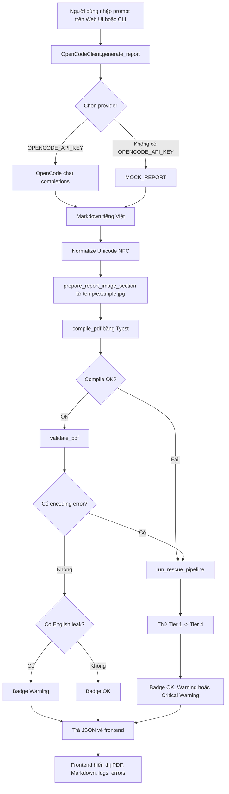

# Hướng dẫn flow hoạt động và giải thích code

Tài liệu này giải thích chi tiết cách project tạo báo cáo Markdown bằng LLM, xử lý ảnh minh họa, biên dịch sang PDF bằng Typst, kiểm tra lỗi font tiếng Việt và tự động chạy rescue pipeline khi có lỗi.

## 1. Mục tiêu của project

Project này là một engine tạo PDF tiếng Việt từ prompt của người dùng. Đầu vào là prompt nhập trên web UI hoặc CLI demo. Đầu ra là file PDF được render bằng Typst, dùng font local để hỗ trợ tiếng Việt, kèm validator để phát hiện lỗi encoding và một số lỗi rò rỉ nhãn tiếng Anh.

Project hỗ trợ 2 chế độ gọi model:

| Thứ tự | Provider | Điều kiện kích hoạt | Mục đích |
| :--- | :--- | :--- | :--- |
| 1 | OpenCode | Có `OPENCODE_API_KEY` | Sinh báo cáo text/Markdown và bảng bằng model `deepseek-v4-flash-free` |
| 2 | Mock offline | Không có `OPENCODE_API_KEY` | Chạy demo và test không cần internet |

## 2. Cấu trúc thư mục

```text
module-gen-file-pdf/
├── src/
│   ├── app.py                 # Flask backend cho web demo
│   ├── demo.py                # CLI end-to-end demo
│   ├── llm_client.py          # Client gọi OpenCode/mock
│   ├── report_image.py        # Tạo section ảnh riêng từ temp/example.jpg
│   ├── image_translator.py    # Module ảnh cũ, còn giữ cho test/hàm phụ trợ
│   ├── typst_generator.py     # Markdown -> Typst -> PDF
│   ├── pdf_validator.py       # Extract text, validate, rescue pipeline
│   ├── mock_adapters.py       # Mock OCR và mock translation
│   └── templates/index.html   # Frontend dashboard
├── fonts/
│   ├── Roboto/
│   ├── NotoSans/
│   └── DejaVuSans/
├── tests/                     # Unit và integration tests
├── temp/                      # PDF, ảnh tạm, output demo
├── docs/
└── requirements.txt
```

## 3. Flow tổng thể



Tóm tắt ngắn:

```text
Prompt người dùng
  -> LLM sinh Markdown
  -> Normalize Unicode NFC
  -> Tách phần ảnh riêng từ temp/example.jpg
  -> Chuyển Markdown sang Typst
  -> Compile PDF
  -> Validate PDF
  -> Rescue nếu có lỗi compile hoặc lỗi encoding
  -> Frontend hiển thị PDF, log và trạng thái
```

## 4. Cấu hình môi trường

File `.env` nên có các biến OpenCode:

```env
OPENCODE_API_KEY=your_api_key_here
OPENCODE_MODEL=deepseek-v4-flash-free
OPENCODE_BASE_URL=https://opencode.ai/zen/v1
OPENCODE_TIMEOUT=300
```

Ý nghĩa:

| Biến | Ý nghĩa |
| :--- | :--- |
| `OPENCODE_API_KEY` | API key để gọi OpenCode |
| `OPENCODE_MODEL` | Model text đang dùng, hiện tại là `deepseek-v4-flash-free` |
| `OPENCODE_BASE_URL` | Base URL của OpenCode API |
| `OPENCODE_TIMEOUT` | Số giây chờ response trước khi timeout, hiện mặc định là `300` |

Nếu không có `OPENCODE_API_KEY`, engine chạy mock offline. Project hiện không còn dùng Gemini ở runtime.

## 5. Web demo trong `src/app.py`

`src/app.py` là Flask backend của dashboard. File này định nghĩa các endpoint chính:

| Endpoint | Method | Mục đích |
| :--- | :--- | :--- |
| `/` | GET | Render frontend từ `src/templates/index.html` |
| `/api/generate` | POST | Chạy full pipeline tạo PDF |
| `/api/pdf` | GET | Trả file PDF mới nhất |
| `/api/image/original` | GET | Trả ảnh nguồn `temp/example.jpg` |
| `/api/image/translated` | GET | Trả ảnh đã xử lý `temp/report_example_translated.png` |

### 5.1. State của lần generate gần nhất

`GenerationState` giữ kết quả của lần generate gần nhất để frontend hiển thị:

```python
class GenerationState:
    def __init__(self):
        self.success = False
        self.badge = "OK"
        self.errors = []
        self.rescue_log = []
        self.markdown = ""
```

| Field | Ý nghĩa |
| :--- | :--- |
| `success` | PDF có được tạo thành công hay không |
| `badge` | Trạng thái tổng hợp: `OK`, `Warning`, `Critical Warning` |
| `errors` | Danh sách lỗi validator phát hiện |
| `rescue_log` | Log từng bước pipeline và rescue |
| `markdown` | Markdown LLM trả về |

### 5.2. Endpoint `/api/generate`

Đây là endpoint quan trọng nhất. Flow chính:

1. Lấy `prompt` và `font` từ request JSON.
2. Tạo `OpenCodeClient`.
3. Gọi `client.generate_report(prompt)`.
4. Normalize Unicode NFC.
5. Gọi `prepare_report_image_section` để xử lý `temp/example.jpg` và append section ảnh.
6. Gọi `compile_pdf`.
7. Gọi `validate_pdf`.
8. Nếu lỗi encoding hoặc compile fail thì gọi `run_rescue_pipeline`.
9. Trả JSON về frontend.

Trích đoạn code chính:

```python
data = request.get_json() or {}
prompt = data.get("prompt", "").strip()
font_name = data.get("font", "Roboto").strip()

client = OpenCodeClient()
report_md = client.generate_report(prompt)
report_md = unicodedata.normalize("NFC", report_md)
state.markdown = report_md

image_result = prepare_report_image_section(
    report_md,
    source_image_path=DEFAULT_SOURCE_IMAGE,
    output_dir=OUTPUT_DIR
)
document_md = image_result.markdown

compile_pdf(document_md, OUTPUT_PDF, font_name=font_name)
validation = validate_pdf(OUTPUT_PDF)
```

### 5.3. Badge logic

`badge` được tính theo kết quả validate và rescue:

| Điều kiện | Badge |
| :--- | :--- |
| Compile OK, validate không lỗi | `OK` |
| Có English leak warning nhưng PDF vẫn dùng được | `Warning` |
| Rescue thành công ở Tier 1, 2 hoặc 3 | `Warning` |
| Chỉ Tier 4 plain text mới cứu được | `Critical Warning` |
| Tất cả rescue fail | `Critical Warning` |

Lưu ý: UI đang hiển thị `api_status` trong box tên `API KEY WARNING / STATUS`, nên dòng `Using OpenCode model: deepseek-v4-flash-free` không phải lỗi. Đó chỉ là status thông báo provider đang dùng.

## 6. OpenCode provider trong `src/llm_client.py`

Class chính hiện là `OpenCodeClient`. Nó chỉ quản lý OpenCode và mock fallback.

### 6.1. Thứ tự chọn provider

Trong `__init__`, code đọc biến môi trường và chọn provider:

```python
self.opencode_api_key = os.environ.get("OPENCODE_API_KEY")
self.opencode_base_url = os.environ.get(
    "OPENCODE_BASE_URL",
    OPENCODE_DEFAULT_BASE_URL
).rstrip("/")
self.opencode_model = os.environ.get("OPENCODE_MODEL", OPENCODE_DEFAULT_MODEL)
self.opencode_timeout = int(os.environ.get("OPENCODE_TIMEOUT", "300"))
```

Sau đó:

```python
if self.opencode_api_key:
    self.provider = "opencode"
    self.mock_mode = False
    self.api_status.append(f"Using OpenCode model: {self.opencode_model}")
else:
    self.api_status.append("OpenCode API key missing (running in offline mock mode)")
```

Nghĩa là nếu `.env` có `OPENCODE_API_KEY`, project sẽ dùng OpenCode. Nếu không có key này, project fallback về mock report để vẫn chạy được offline.

### 6.2. Gọi OpenCode chat completions

Hàm `_opencode_chat_completion` gọi endpoint:

```text
POST https://opencode.ai/zen/v1/chat/completions
```

Payload dạng OpenAI-compatible:

```python
{
    "model": self.opencode_model,
    "messages": messages,
    "temperature": temperature,
}
```

Header:

```python
{
    "Authorization": f"Bearer {self.opencode_api_key}",
    "Content-Type": "application/json",
}
```

Timeout:

```python
timeout=self.opencode_timeout
```

Mặc định timeout là `300` giây.

### 6.3. Sinh báo cáo Markdown

`generate_report(prompt)` trả về Markdown. Nếu provider là OpenCode, nó gửi system prompt yêu cầu model trả về Markdown tiếng Việt có tiêu đề, bảng và danh sách:

```python
system_prompt = (
    "Bạn là chuyên gia logistics và biên tập kỹ thuật. "
    "Hãy tạo báo cáo bằng Markdown tiếng Việt, rõ ràng, có cấu trúc. "
    "Bắt buộc có: tiêu đề H1, các đoạn văn giải thích, ít nhất một bảng Markdown "
    "đúng cú pháp, và danh sách gạch đầu dòng hoặc đánh số. "
    "Không bọc câu trả lời trong code fence. Hạn chế dùng cụm tiếng Anh nếu không cần thiết."
)
```

Sau đó bổ sung prompt người dùng:

```python
user_prompt = (
    f"{prompt}\n\n"
    "Yêu cầu đầu ra: trả về trực tiếp nội dung Markdown tiếng Việt để render PDF. "
    "Bảng Markdown nên có 2-4 cột và có hàng phân cách `| :--- |` hợp lệ."
)
```

Nếu OpenCode fail, timeout, rate limit hoặc trả response lỗi, code fallback về `MOCK_REPORT`:

```python
except Exception as e:
    self.api_status.append(f"OpenCode report generation failed: {e}")
    print(f"Warning: OpenCode API call failed ({e}). Falling back to mock report.")
    return MOCK_REPORT
```

### 6.4. Dịch label ảnh

`translate_labels(labels)` dùng để dịch các nhãn tiếng Anh trong ảnh sang tiếng Việt.

Với OpenCode, model được yêu cầu trả strict JSON:

```python
prompt = (
    "Translate these warehouse or diagram labels from English to Vietnamese. "
    "Return strict JSON only, no markdown, no explanation. "
    "Schema: {\"translations\": [{\"english\": string, \"vietnamese\": string}]}. "
    f"Labels: {json.dumps(labels, ensure_ascii=False)}"
)
```

Code có hàm `_load_json_from_model_text` để parse JSON ngay cả khi model bọc trong code fence:

```python
fenced = re.search(
    r"```(?:json)?\s*(.*?)```",
    cleaned,
    flags=re.DOTALL | re.IGNORECASE
)
if fenced:
    cleaned = fenced.group(1).strip()
return json.loads(cleaned)
```

Nếu model không trả đủ label, code fallback từng label bằng `MOCK_TRANSLATION_MAP`.

## 7. Phần ảnh riêng trong `src/report_image.py`

Module này tách phần ảnh ra khỏi nội dung do model sinh. Model chỉ sinh text/Markdown; ảnh luôn được xử lý từ file nguồn cố định:

```text
temp/example.jpg
```

Sau khi xử lý, ảnh output được lưu tại:

```text
temp/report_example_translated.png
```

PDF sẽ nhận thêm một section Markdown riêng:

```markdown
## Phụ lục hình ảnh minh họa

Sơ đồ dưới đây được xử lý từ file ảnh nguồn `temp/example.jpg`
và được chèn vào PDF như một phần riêng của báo cáo.


```

### 7.1. Vì sao tách ảnh ra riêng?

Trước đây phần ảnh phụ thuộc vào image tag trong Markdown do LLM sinh ra. Cách đó dễ bị lỗi vì model có thể không sinh ảnh, sinh sai path hoặc sinh cú pháp Markdown khác nhau.

Flow mới chủ động hơn:

1. LLM sinh nội dung báo cáo dạng text/bảng.
2. Code xóa các image tag cũ nếu model có sinh.
3. Code xử lý `temp/example.jpg`.
4. Code append một section ảnh riêng vào cuối Markdown.
5. Typst compile ảnh đó vào PDF.

### 7.2. Render ảnh từ `example.jpg`

Hàm chính:

```python
render_example_image_for_pdf(
    source_image_path="temp/example.jpg",
    output_dir="temp",
    output_name="report_example_translated.png",
)
```

Hàm này:

1. Mở `temp/example.jpg`.
2. Dùng danh sách tọa độ cố định của các label trong ảnh mẫu.
3. Vẽ đè các label tiếng Anh bằng label tiếng Việt.
4. Auto-fit font để chữ không tràn khỏi hộp label.
5. Lưu thành PNG để Typst chèn vào PDF ổn định hơn.

Một label box ví dụ:

```python
{"text": "Inbound Docks", "box": (278, 24, 225, 43), "fill": "#0B7A35", "text_fill": "#FFFFFF"}
```

Mapping dịch:

```python
DEFAULT_TRANSLATIONS = {
    "Inbound Docks": "Cảng nhập",
    "Outbound Docks": "Cảng xuất",
    "Processing Area": "Khu xử lý",
    ...
}
```

### 7.3. Xóa image tag do model sinh

Hàm:

```python
strip_markdown_images(markdown_content)
```

Mục tiêu là không để LLM kiểm soát ảnh trong PDF. Nếu model có sinh:

```markdown

```

thì nó sẽ bị xóa trước khi section ảnh riêng được append.

### 7.4. Append section ảnh

Hàm:

```python
prepare_report_image_section(markdown_content)
```

trả về `ImageSectionResult` gồm:

| Field | Ý nghĩa |
| :--- | :--- |
| `markdown` | Markdown đã xóa image tag cũ và append section ảnh mới |
| `source_image_path` | Ảnh nguồn, mặc định `temp/example.jpg` |
| `output_image_path` | Ảnh đã xử lý, mặc định `temp/report_example_translated.png` |
| `log` | Log xử lý ảnh |
| `success` | Có tạo được ảnh hay không |

## 8. Markdown sang Typst trong `src/typst_generator.py`

Module này nhận Markdown và tạo PDF bằng Typst.

### 8.1. Chuyển Markdown table sang Typst table

Hàm:

```python
convert_markdown_table_to_typst(markdown_table_lines: List[str]) -> str
```

Làm các việc:

1. Tách từng dòng bảng.
2. Tách cell bằng ký tự `|`.
3. Bỏ dòng separator như `| :--- | :--- |`.
4. Lấy số cột theo header.
5. Render Typst table.

Ví dụ Markdown:

```markdown
| Khu vực | Vai trò |
| :--- | :--- |
| Nhập hàng | Tiếp nhận và kiểm tra |
```

Sẽ thành Typst:

```typst
#table(
  columns: (1fr, 1fr),
  align: (left, ) * 2,
  [* Khu vực *],
  [* Vai trò *],
  [Nhập hàng],
  [Tiếp nhận và kiểm tra]
)
```

### 8.2. Chuyển các thành phần Markdown cơ bản

Hàm:

```python
convert_markdown_to_typst(markdown_text: str) -> str
```

Hỗ trợ:

| Markdown | Typst |
| :--- | :--- |
| `# Title` | `= Title` |
| `## Title` | `== Title` |
| `- item` | `- item` |
| `1. item` | `+ item` |
| `**bold**` | `*bold*` |
| `*italic*` | `_italic_` |
| `` | `#image("path", width: 90%)` |
| Markdown table | `#table(...)` |

### 8.3. Typst template

Hàm:

```python
generate_typst_document(content_markdown, font_name="Roboto", simplified=False)
```

Với mode bình thường, template đặt:

```typst
#set page(
  paper: "a4",
  margin: (x: 2cm, y: 2.5cm),
  header: align(right)[Báo cáo Kho hàng Thông minh],
  footer: context align(center)[Trang #counter(page).display("1 / 1", both: true)]
)

#set text(
  font: "Roboto",
  size: 11pt,
  lang: "vi",
  region: "vn",
  spacing: 120%
)

#set par(
  leading: 0.65em,
  justify: true
)
```

Với rescue simplified mode, template bỏ header/footer/justify để giảm nguy cơ lỗi layout.

### 8.4. Compile PDF

Hàm:

```python
compile_pdf(content_markdown, output_pdf_path, font_name="Roboto", simplified=False)
```

Flow:

1. Tạo Typst source.
2. Ghi tạm vào `temp_doc.typ`.
3. Gọi `typst.compile`.
4. Truyền font paths local.
5. Xóa file tạm.

Code compile:

```python
typst.compile(
    input=temp_typ_path,
    output=output_pdf_path,
    font_paths=font_dirs,
    ignore_system_fonts=True
)
```

`ignore_system_fonts=True` giúp kết quả ổn định hơn vì chỉ dùng fonts trong project.

## 9. Validate PDF trong `src/pdf_validator.py`

Validator đọc text từ PDF bằng `pdfplumber`.

### 9.1. Extract text

```python
def extract_text(pdf_path: str) -> str:
    pages_text = []
    with pdfplumber.open(pdf_path) as pdf:
        for page in pdf.pages:
            text = page.extract_text() or ""
            pages_text.append(text)
    full_text = "\n".join(pages_text)
    return unicodedata.normalize("NFC", full_text)
```

Normalize NFC giúp so sánh tiếng Việt ổn định hơn, tránh trường hợp dấu tiếng Việt bị tách thành combining characters.

### 9.2. Kiểm tra lỗi font, glyph, encoding

Hàm:

```python
check_missing_glyphs(pdf_path)
```

Nó tìm ký tự thay thế Unicode:

```text
U+FFFD: �
```

Nếu trong PDF extracted text có `�`, đó là dấu hiệu font hoặc encoding có vấn đề.

```python
if "\uFFFD" in text:
    count = text.count("\uFFFD")
    errors.append(ValidationError(
        error_type="encoding",
        message=f"Found {count} replacement character(s) ...",
        page_number=page_idx,
        detail=f"\uFFFD x{count}"
    ))
```

### 9.3. Kiểm tra leaked English labels

Hàm:

```python
check_leaked_english(pdf_path, labels=None)
```

Nó so sánh text PDF với danh sách label trong `MOCK_TRANSLATION_MAP`, vì các label này lẽ ra phải được dịch sang tiếng Việt trong ảnh hoặc nội dung:

```python
ENGLISH_LEAK_LABELS = list(MOCK_TRANSLATION_MAP.keys())
```

Nếu model sinh các acronym như `WMS`, validator có thể báo warning vì `WMS` nằm trong danh sách label cần dịch. Đây là warning về nội dung, không phải lỗi font.

### 9.4. Kết quả validate

`validate_pdf` gom tất cả check:

```python
glyph_errors = check_missing_glyphs(pdf_path)
leak_errors = check_leaked_english(pdf_path)

result.errors = glyph_errors + leak_errors
result.is_valid = len(result.errors) == 0
```

Nếu chỉ có leak warning, PDF vẫn tạo được. UI sẽ hiển thị `Warning`.

## 10. Rescue pipeline 4 tầng

Nếu compile fail hoặc validator phát hiện lỗi encoding, project gọi:

```python
run_rescue_pipeline(content_markdown, output_pdf_path, font_name="Roboto")
```

### 10.1. Tổng quan các tier

| Tier | Tên | Việc làm | Badge nếu thành công |
| :--- | :--- | :--- | :--- |
| 0 | Initial | Compile và validate ban đầu | `OK` |
| 1 | NFC normalization | Normalize Unicode NFC, xóa U+FFFD | `Warning` |
| 2 | Fallback fonts | Thử `Roboto`, `Noto Sans`, `DejaVu Sans` | `Warning` |
| 3 | Simplified layout | Bỏ layout phức tạp, đổi ảnh/bảng thành text | `Warning` |
| 4 | Plain text | Strip Markdown, giữ plain text tiếng Việt | `Critical Warning` |

### 10.2. Tier 1: Unicode NFC

```python
def _rescue_tier1_nfc(content: str) -> str:
    normalized = unicodedata.normalize("NFC", content)
    normalized = normalized.replace("\uFFFD", "")
    return normalized
```

Mục tiêu là sửa các vấn đề dấu tiếng Việt đang decomposed hoặc có ký tự thay thế.

### 10.3. Tier 2: Fallback fonts

Font chain:

```python
FALLBACK_FONT_CHAIN = ["Roboto", "Noto Sans", "DejaVu Sans"]
```

Nếu font người dùng chọn có vấn đề, pipeline thử font khác:

```python
for fallback_font in FALLBACK_FONT_CHAIN:
    if fallback_font == font_name:
        continue
    result = _try_compile_and_validate(nfc_content, output_pdf_path, fallback_font)
```

### 10.4. Tier 3: Simplified layout

Hàm `_rescue_tier3_simplify`:

1. Bỏ image tags, thay bằng dòng note tiếng Việt.
2. Chuyển table thành bullet key-value.
3. Giữ text chính.

Ví dụ:

```markdown
| Khu vực | Vai trò |
| :--- | :--- |
| Nhập hàng | Kiểm tra |
```

Thành:

```markdown
- Khu vực: Nhập hàng
- Vai trò: Kiểm tra
```

### 10.5. Tier 4: Plain text fallback

Hàm `_rescue_tier4_plaintext` xóa gần như toàn bộ Markdown:

| Thành phần | Cách xử lý |
| :--- | :--- |
| Image | Xóa |
| Heading | Giữ text title |
| Bold/italic | Xóa marker, giữ nội dung |
| Table | Chuyển thành dòng plain text |
| List marker | Xóa marker |
| Vietnamese accents | Giữ lại và normalize NFC |

Tier 4 là cứu cánh cuối cùng, nên nếu thành công thì badge là `Critical Warning`.

## 11. Frontend trong `src/templates/index.html`

Frontend có 4 tab:

| Tab | Nội dung |
| :--- | :--- |
| PDF Preview | Nhúng iframe hiển thị file `/api/pdf` |
| Diagrams | Hiển thị ảnh gốc và ảnh đã dịch |
| Markdown Source | Hiển thị Markdown model trả về |
| Rescue & Validation logs | Hiển thị log pipeline |

Khi bấm nút tạo báo cáo, JavaScript gọi:

```javascript
const response = await fetch('/api/generate', {
    method: 'POST',
    headers: { 'Content-Type': 'application/json' },
    body: JSON.stringify({ prompt, font })
});

const data = await response.json();
```

Sau đó frontend:

1. Cập nhật box API/status.
2. In `rescue_log`.
3. Gán `markdownSource.value = data.markdown`.
4. Cập nhật error count.
5. Nếu success thì reload PDF iframe bằng cache buster:

```javascript
const cacheBuster = `?t=${new Date().getTime()}`;
pdfFrame.src = `/api/pdf${cacheBuster}`;
```

## 12. CLI demo trong `src/demo.py`

`src/demo.py` chạy cùng pipeline nhưng qua terminal:

```bash
venv/bin/python src/demo.py
```

Flow:

1. Tạo `OpenCodeClient`.
2. In provider đang dùng: mock hoặc OpenCode.
3. Gọi `generate_report`.
4. Gọi `prepare_report_image_section`.
5. Gọi `compile_pdf`.
6. Gọi `validate_pdf`.
7. Nếu cần thì rescue.
8. In summary.

Output PDF:

```text
temp/demo_report.pdf
```

## 13. Các file output trong `temp/`

| File | Mục đích |
| :--- | :--- |
| `temp/web_report.pdf` | PDF mới nhất từ web UI |
| `temp/demo_report.pdf` | PDF mới nhất từ CLI demo |
| `temp/example.jpg` | Ảnh nguồn cố định cho phần hình ảnh |
| `temp/report_example_translated.png` | Ảnh đã xử lý để chèn vào PDF |
| `temp/raw_report.md` | Sample Markdown/báo cáo tạm |

## 14. Các trạng thái thường gặp trên UI

### 14.1. `Using OpenCode model: deepseek-v4-flash-free`

Đây là status, không phải lỗi. Nó chỉ báo rằng server đang dùng OpenCode model.

### 14.2. `OpenCode report generation failed: Read timed out`

Đây là lỗi timeout khi gọi API. Nguyên nhân thường gặp:

| Nguyên nhân | Cách xử lý |
| :--- | :--- |
| Prompt quá dài | Rút ngắn prompt hoặc chia thành nhiều lần |
| Model free đang chậm | Thử lại sau |
| Timeout thấp | Tăng `OPENCODE_TIMEOUT`, hiện tại đã là `300` |
| Kết nối mạng bất ổn | Thử lại |

Khi gặp lỗi này, code fallback về `MOCK_REPORT`, nên PDF có thể vẫn được tạo nhưng không phải nội dung prompt vừa nhập.

### 14.3. `Warning` do English leak

Nếu validator báo leak như `WMS`, `ASRS Storage`, `Inbound Processing`, đây không nhất thiết là lỗi font. Nó chỉ là cảnh báo có cụm tiếng Anh nằm trong danh sách labels cần dịch.

Nếu muốn giảm false positive, có thể:

1. Bỏ các acronym hợp lệ khỏi `MOCK_TRANSLATION_MAP`.
2. Chỉ check leak trong ảnh, không check toàn body text.
3. Cho phép whitelist các thuật ngữ như `WMS`, `ERP`, `AGV`, `ASRS`.

## 15. Cách chạy project

### 15.1. Cài dependencies

```bash
pip install -r requirements.txt
```

Nếu dùng virtualenv hiện có:

```bash
venv/bin/pip install -r requirements.txt
```

### 15.2. Chạy web demo

Mặc định trong `src/app.py` là port `8085`:

```bash
venv/bin/python src/app.py
```

Nếu port `8085` bị chiếm, có thể dùng Flask CLI port khác:

```bash
venv/bin/python -m flask --app src.app run --host 0.0.0.0 --port 8086
```

Mở trình duyệt:

```text
http://127.0.0.1:8086
```

### 15.3. Chạy CLI demo

```bash
venv/bin/python src/demo.py
```

### 15.4. Chạy test

Chạy tất cả test offline:

```bash
OPENCODE_API_KEY= POLLINATIONS_API_KEY= \
venv/bin/python -m unittest discover -s tests
```

Chạy riêng test LLM client:

```bash
venv/bin/python -m unittest tests.test_llm_client
```

## 16. Điểm cần chú ý khi phát triển tiếp

### 16.1. Project hiện là OpenCode-only

Các import runtime hiện dùng:

```python
from src.llm_client import OpenCodeClient
```

Dependency LLM cũ đã được loại khỏi `requirements.txt`.

### 16.2. Timeout đã tăng lên 300 giây

Timeout mới nằm trong:

```python
self.opencode_timeout = int(os.environ.get("OPENCODE_TIMEOUT", "300"))
```

Nếu đổi `.env`, cần restart Flask server để biến mới có hiệu lực.

### 16.3. UI warning box đang hơi gây hiểu nhầm

Frontend hiện `api_status` trong box tên:

```text
API KEY WARNING / STATUS
```

Nên đổi thành:

```text
LLM PROVIDER STATUS
```

Và chỉ tô màu đỏ khi message có từ khóa lỗi như:

| Keyword | Nên coi là lỗi? |
| :--- | :--- |
| `failed` | Có |
| `error` | Có |
| `timeout` | Có |
| `missing` | Có |
| `Using OpenCode model` | Không |

### 16.4. Prompt quá dài có thể làm model free timeout

Nếu muốn test font tiếng Việt, nên dùng prompt dài vừa phải, khoảng 800 đến 1500 từ. Prompt 3000 từ và nhiều bảng có thể chậm với model free.

### 16.5. Validator English leak hiện đang check toàn văn bản

Hiện tại validator không phân biệt text body và nhãn ảnh. Nếu report có nội dung hợp lệ như:

```text
WMS là hệ thống quản lý kho...
```

Nó vẫn có thể báo warning nếu `WMS` nằm trong map. Đây là nơi có thể cải tiến.

## 17. Tóm tắt flow ngắn gọn

```text
Prompt người dùng
  -> OpenCodeClient.generate_report
  -> OpenCode/mock trả Markdown
  -> normalize NFC
  -> prepare_report_image_section từ temp/example.jpg
  -> convert_markdown_to_typst
  -> typst.compile
  -> validate_pdf
  -> nếu lỗi encoding/compile thì run_rescue_pipeline
  -> trả JSON về frontend
  -> frontend hiển thị PDF, markdown, logs, badge
```

Nếu cần debug, thứ tự nên xem log:

1. `api_status`: provider/model/lỗi API.
2. `rescue_log`: từng bước pipeline.
3. `errors`: lỗi validator.
4. `markdown`: text model trả về.
5. `temp/web_report.pdf`: PDF output.
